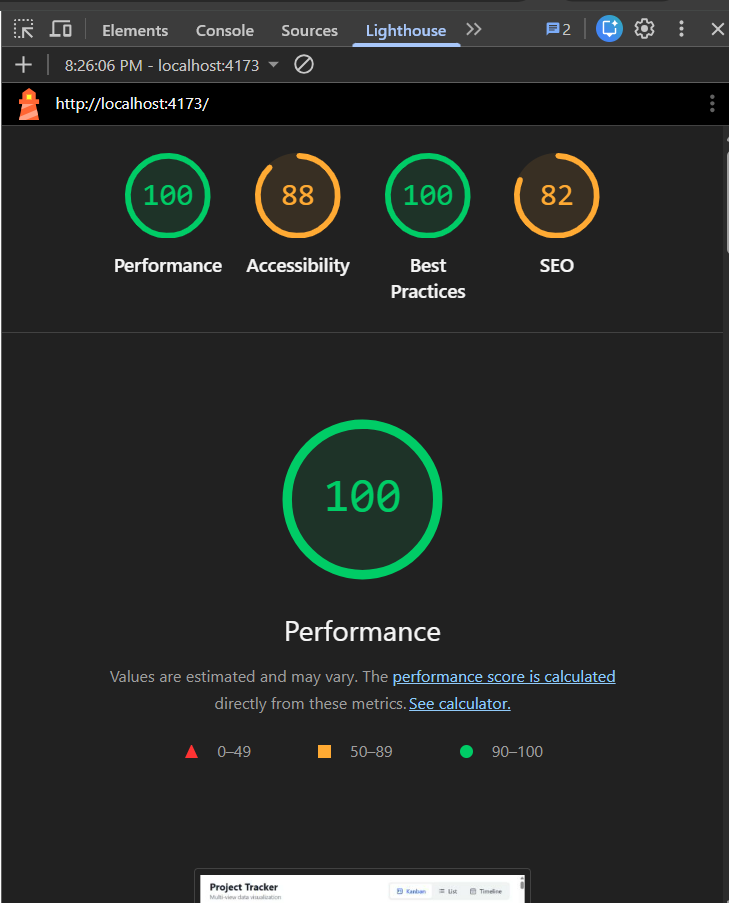

# Multi-View Project Tracker

**🚀 [Live Demo (Vercel/Netlify) - Click Here](https://your-project-link.vercel.app/)**

A fully functional frontend application for a project management tool. Features three different views of the same data, a custom-built drag-and-drop system, virtual scrolling for large lists, and real-time collaboration indicators.

## Setup Instructions

1. **Install dependencies**
   ```bash
   npm install
   ```

2. **Run the development server**
   ```bash
   npm run dev
   ```

3. **Build for production**
   ```bash
   npm run build
   npm run preview
   ```

## Lighthouse Performance


*(Please replace `./lighthouse.png` with a screenshot of your Lighthouse report before submitting)*

## State Management Architecture

**Zustand** was chosen for state management for the following reasons:
1. **Performance**: Unlike React Context which triggers re-renders for all consumers when any value changes, Zustand allows components to subscribe to specific slices of state. This is crucial for a data-heavy application containing 500+ tasks where rendering performance is a priority.
2. **Minimal Boilerplate**: It avoids the heavy boilerplate of Redux while providing a centralized, predictable store.
3. **Outside React Scope**: Zustand allows state mutations outside of React components (like the `setInterval` in our collaboration simulation) without needing complex hook wrestling or passing dispatch references.

## Virtual Scrolling Implementation

Virtual scrolling in the List View is implemented entirely from scratch via the `useVirtualScroll` hook:
- Instead of rendering all 500+ tasks in the DOM, the hook calculates a visible window based on `scrollTop`, `rowHeight`, and `containerHeight`.
- It renders only the visible rows plus an `overscan` buffer of 5 rows above and below.
- The scrollbar is preserved by adding a hidden wrapper with a height of `totalRows * rowHeight`.
- The visible container is visually pushed down using a CSS `transform: translateY(offsetY)` equivalent to `startIndex * rowHeight`.
- This ensures O(1) rendering time no matter how large the dataset grows, preventing the heavy DOM layout recalculations that cause scrolling lag.

## Custom Drag-and-Drop Implementation

Drag and drop is built from scratch strictly using the native **Pointer Events API** to guarantee cross-device compatibility (Mouse and Touch support).
- **Initialization**: On `pointerdown`, we snapshot the dragged card's dimensions and capture the pointer.
- **Ghost Element**: We clone the task card inside a `position: fixed` element that follows the cursor on `pointermove` using highly performant CSS `transform: translate()` (preventing Layout shifts).
- **Placeholder**: Simultaneously, we inject a placeholder `div` with exact height/margins in the old DOM slot to maintain structure without layout jumping. The original card is temporarily hidden (`opacity: 0`) and stripped of `pointer-events`.
- **Drop Zones**: We give the ghost card `pointer-events: none` allowing `document.elementFromPoint()` to correctly identify the column directly underneath the cursor.
- **Completion**: On `pointerup`, if dropped into a new column, the Zustand store updates the task status to instantly trigger React's diffing, removing the ghost elements. If an invalid drop occurs, the ghost card animates back to its original bounding rect cleanly.

## Design Decisions

- **Tailwind CSS** for rapid and consistent atomic styling.
- **History API**: Filters are synchronized to the URL via `history.replaceState` and the `popstate` listener inside `useFilterSync.ts`, avoiding the overhead of heavy routing libraries while natively supporting back/forward navigation.

## Short Explanation (150-250 words)

The hardest UI problem to solve was implementing a flawless custom drag-and-drop experience that worked natively on both mobile touch screens and desktop mice without third-party tools. Creating a drag placeholder without Layout Shift was accomplished by injecting an empty `div` that computed the exacte height (`getBoundingClientRect().height`) and bottom margins of the original card immediately upon pointer-down. This preserved the document flow perfectly. The original task element wasn't detached from the DOM; instead it was overlaid with `opacity-0` and `pointer-events-none`. The "dragging" card the user sees is entirely a `position: fixed` clone.

With more time, I would refactor the **Timeline / Gantt View** virtualization mechanism. Currently, while the List view handles 500 items via custom virtual scrolling out-of-the-box, the Gantt rendering logic could benefit from an intricate 2D windowing algorithm—both for vertical task list rendering and right-ward horizontal day navigation, to ensure it continues to hit 60fps scrolling on low-power devices.

